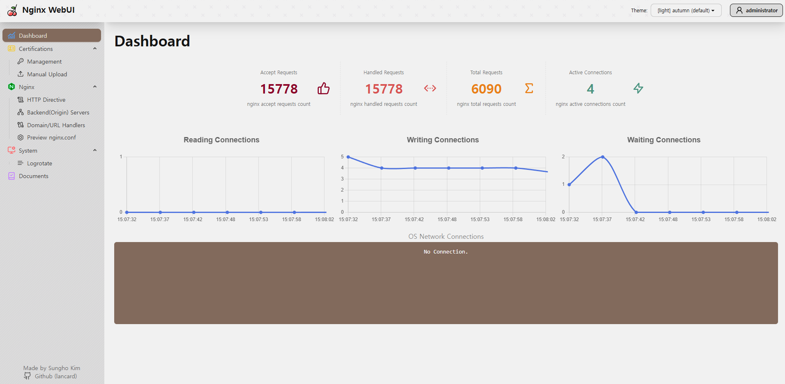
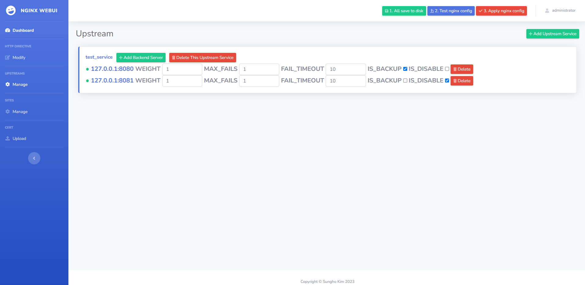
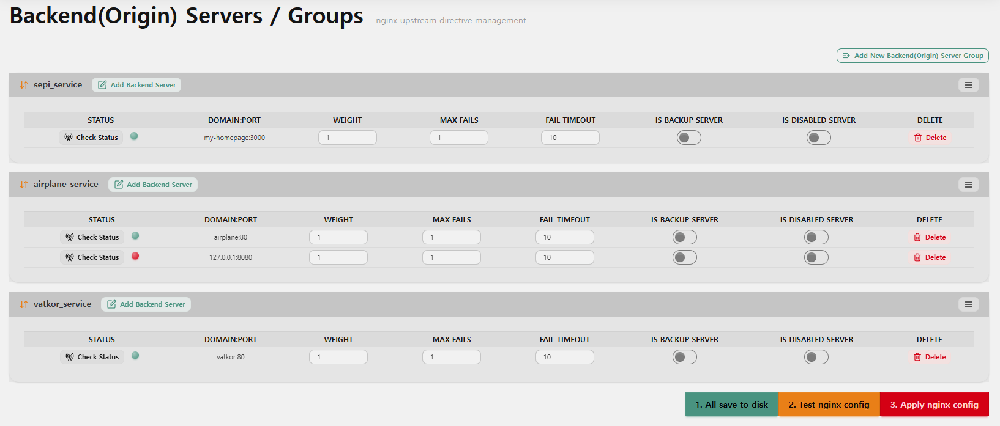
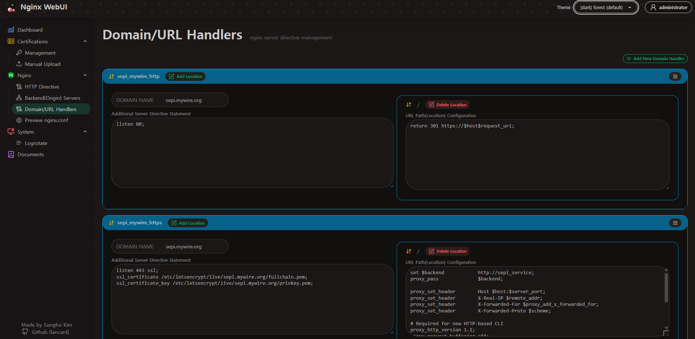

# NGINX WebUI

[](https://github.com/lancard/nginx-webui/actions/workflows/build-docker.yml)


> **Manage NGINX like a pro, without touching the terminal.**  
> Simple, powerful, and production-ready NGINX management UI with Let's Encrypt integration.

---

## Features

- One-click reverse proxy setup
- Automatic [Let's Encrypt](https://letsencrypt.org) certificate issuance & renewal (incl. DNS challenge)
- Integrated WAF with Anubis: Protect your applications with intelligent request filtering and attack mitigation.
- Anti-Crawling & Bot Protection: Block unwanted scrapers and abusive traffic with adaptive [Anubis](https://github.com/TecharoHQ/anubis) rules.
- **Path Rewriting & Redirects**: Fine-grained control over request rewriting and redirect rules.
- **Static File Hosting**: Easily expose folders with access control.
- CI/CD-friendly API to enable/disable upstream backends  
- [Logrotate](https://github.com/logrotate/logrotate) configuration via UI  
- Superuser/admin mode for advanced NGINX config  
- Designed for managing **multiple domains** and **teams**  
- Non-disruptive deployments using Jenkins or other CI/CD tools  
- Built with **full ES Modules (ESM)** for modern, modular Node.js architecture  
- **Responsive, mobile-friendly UI** that adapts to desktop, tablet, and phone layouts  
- **Lightweight and minimal UI stack**: [tailwind](https://tailwindcss.com), [daisyui](https://daisyui.com) etc. (no heavy frameworks)  
- Instant config reload & validation - UI-triggered NGINX config test + reload  
- **certificate data persisted in Docker volumes**, ready for production
- Easy setup with production-grade **Docker-Compose**
- **NGINX Status Dashboard**: Real-time stats including active OS-level connections.
- **Dark Mode & Themes**: Modern UI with theme switching support.
- **Backend Health Check**: Ping and verify backend server availability.
- Nginx access / error log display.

---

## Screenshots

| UI Overview | Cert Management | Backend Server | Domain/URL |
|------------|----------------|----------------|-----------|
|  |  |  |  |

---

## Video Tutorials

- **Install & Load-Balancer Setup**  
  [](https://www.youtube.com/watch?v=3SEdU_Jj5IM)

- **CI/CD + Non-disruptive Deployment**  
  [](https://www.youtube.com/watch?v=UaJF-s2AuZo)

- **Let's Encrypt Certificate Renewal**  
  [](https://www.youtube.com/watch?v=O12f2PYPCpU)

---

## Quick Setup

1. Install Docker and Docker-Compose

- [Docker Install documentation](https://docs.docker.com/install/)
- [Docker-Compose Install documentation](https://docs.docker.com/compose/install/)

2. Create a docker-compose.yml file similar to this:

```yml
version: '3.7'
services:
  nginx-webui:
    image: lancard/nginx-webui
    container_name: nginx-webui
    environment:
      - TZ=Asia/Seoul
    ulimits:
      memlock:
        soft: -1
        hard: -1
    restart: always
    ports:
      - 80:80
      - 81:81
      - 443:443
    volumes:
      - nginx-webui-data:/data
      - nginx-webui-log:/var/log/nginx

volumes:
  nginx-webui-data:
  nginx-webui-log:
```

3. Set environment variable if you need (it not set, nginx-webui will generate keys automatically and you can find keys in docker logs)
```
JWT_SECRET=abcdefgh
JWT_EXPIRES_IN=1h
TRUST_PROXY=1
```
Setting JWT_SECRET is beneficial in scenarios such as server reboots or when load balancing across multiple nginx-webui servers.
To obtain the real IP address of the client, set the TRUST_PROXY environment variable. (Specify how many proxies are in front of the server.)

4. Run docker-compose

```bash
docker-compose up -d
docker-compose logs # for check admin password
```

5. Log in to the Admin UI

The 'administrator' user password is randomly generated by first time.
you can check it by 'docker-compose logs'

When your docker container is running, connect to it on port `81` for the admin interface.
(The connection is secured with a self-signed certificate. If you receive a security warning message, ignore it and continue)

[https://127.0.0.1:81](http://127.0.0.1:81)

Default Admin User:
```
id: administrator
password: (get it from docker-compose logs)
```

6. Setup Config

Refer Screenshot 4

7. Use API for CI/CD

```
curl --insecure -H "Authorization: Bearer ${token}" "https://localhost:81/api/upstream/${upstream-name}/${backend-address}/enable"
curl --insecure -H "Authorization: Bearer ${token}" "https://localhost:81/api/upstream/${upstream-name}/${backend-address}/disable"
```

---

## Reset password

```
cd /admin
npm run password
```

---

## Migration Guide

If you're upgrading from a previous version, please refer to the [MIGRATION.md](./MIGRATION.md) for detailed steps and compatibility notes.

---

## Install sshd for development (for contribution)

- Create a volume and make id_rsa.pub file then attach the volume to /root/.ssh
- It will open ssh server automatically.
- change directory /root/nginx-webui/admin
- execute 'npm run watch'
- it will open 7777 port

---

## Built With

- server side: npm, nodejs, express
- client side: daisyui, tailwind, esbuild, jquery, dayjs, chart.js

---

## Contributing

Feel free to make PR!
Don't forget to give the project a star! Thank you!

1. Fork the Project
2. Create your Feature Branch (`git checkout -b feature/AmazingFeature`)
3. Commit your Changes (`git commit -m 'Add some AmazingFeature'`)
4. Push to the Branch (`git push origin feature/AmazingFeature`)
5. Open a Pull Request

---

## Contributor License Agreement

For easy license management and legal dispute avoidance, the contributing codes are attributed to the author and all rights are attributed to the author. In addition, the MIT license is maintained. If you don't want it, please don't make PR.

---

## License

MIT License
