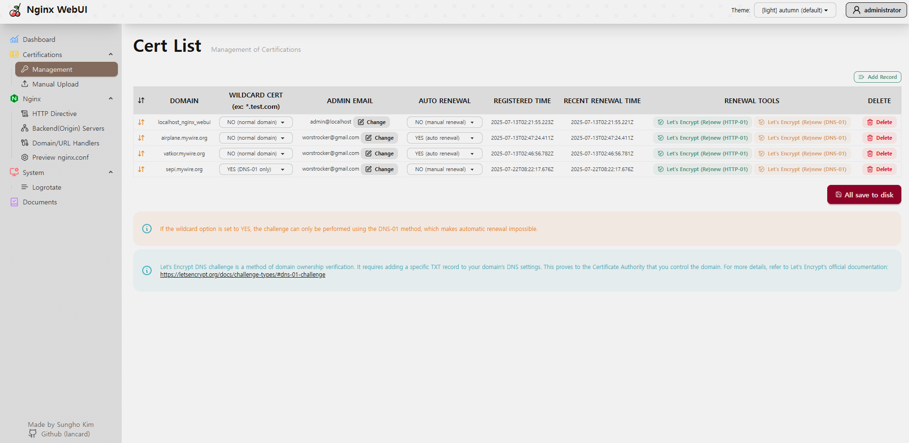

[](https://github.com/lancard/nginx-webui/actions/workflows/build-docker.yml)


This project aims to create a UI that wrap nginx.
We developed a program that makes it easy for companies and people with multiple domains to manage nginx through UI.

## Screenshot




## Project Goal

Basically, a program was written to make it easy to use reverse proxy.
main goal is management for 'upstream' / 'server' / certificates nginx configuration.

## Features

- modify reverse proxy and multiple upstream settings with web UI.
- Easily create services and locations.
- Advanced Nginx configuration available for super users
- login management

## Quick Setup

1. Install Docker and Docker-Compose

- [Docker Install documentation](https://docs.docker.com/install/)
- [Docker-Compose Install documentation](https://docs.docker.com/compose/install/)

2. Create a docker-compose.yml file similar to this:

```yml
version: '3.7'
services:
  nginx-webui:
    image: lancard/nginx-webui
    container_name: nginx-webui
    environment:
      - TZ=Asia/Seoul
    ulimits:
      memlock:
        soft: -1
        hard: -1
    restart: always
    ports:
      - 80:80
      - 81:81
      - 443:443
    volumes:
      - nginx-webui-data:/data
      - nginx-webui-cert:/cert
      - nginx-webui-session:/session
      - nginx-webui-log:/var/log/nginx

volumes:
  nginx-webui-data:
  nginx-webui-cert:
  nginx-webui-session:
  nginx-webui-log:
  ```

3. Run docker-compose

```bash
docker-compose up -d
docker-compose logs # for check admin password
```

4. Log in to the Admin UI

The 'administrator' user password is randomly generated by first time.
you can check it by 'docker-compose logs'

When your docker container is running, connect to it on port `81` for the admin interface.
(The connection is secured with a self-signed certificate. If you receive a security warning message, ignore it and continue)

[https://127.0.0.1:81](http://127.0.0.1:81)

Default Admin User:
```
id: administrator
password: (get it from docker-compose logs)
```


## Built With

- nodejs
- express
- sbadmin2 (bootstrap)
- jquery
- dayjs
- codemirror
- chart.js


## Contributing

Feel free to make PR!
Don't forget to give the project a star! Thank you!

1. Fork the Project
2. Create your Feature Branch (`git checkout -b feature/AmazingFeature`)
3. Commit your Changes (`git commit -m 'Add some AmazingFeature'`)
4. Push to the Branch (`git push origin feature/AmazingFeature`)
5. Open a Pull Request


## License

MIT License
